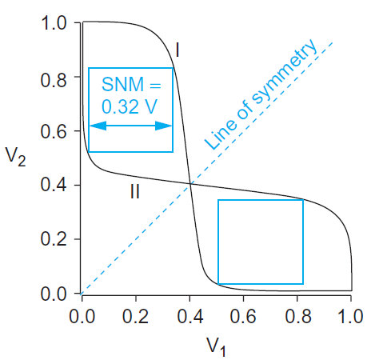
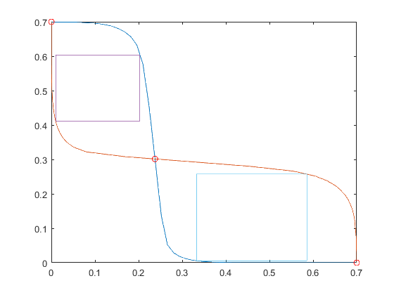

# Largest Square Between Two Curves, Static Noise Margins 

This is a code written with Matlab where calculate the length of the side of the largest square that can be inscribed between 2 curves.
This code have been written to calculate static noise margins of a sram cell. The static noise margin (SNM) measures how much noise can be applied to the inputs of the two cross-coupled inverters before a stable state is lost (during hold or read) or a second stable state is created (during write). The static noise margin can be determined graphically from a butterfly diagram like figure below.

## Getting Started
  - Extract data from your simulations
    - .csv file for curve I
    - .csv file for curve II

# Running the code
 - Change the path of .csv files
 - Run the program
    -    Press any button to plot the largest square at the top (up) eye. 
    -   Press ESC to continue with the bottom "down" eye
    -   Press any button to plot the largest square in the bottom "down" eye
    -    The side of of the largest square of the smallest eye is being printed
    
# Result

## Troubleshooting
Sometimes code does not find the largest square at steps 2.1 and step 2.3. If this happens then do not press ESC to continue but press any button until you find the biggest square.

# Authors
- Schoinochoritis Ioannis
# Contact
- Email: g.sxoin@hotmail.com
